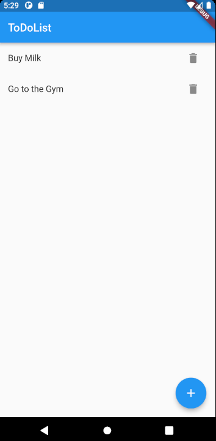

# todo
A Todo App to track your daily Todo's.

## Motivation
I created a todo App to learn Flutter and Dart.

## Screenshots

## Framework used
- [Flutter](https://flutter.dev/)

## Features
- Overview of all your Todos
- Add new Todos
- Delete Todos which are done

## How to use?
- Create apk with `flutter build apk`
- Install apk on your device